# 로얄캣 (Royal Cat)

## Ⅰ. 프로젝트 소개

### 개요

- 남녀노소 쉽게 즐길 수 있는 3D 배틀 로얄 슈팅 게임

### 기간 및 인원

- 2024.08 ~ 2024.10 (약 2개월)
- 6인 (클라이언트 4인, 서버 2인)

### 게임 스토리

### 고양이 왕국의 왕이 되기 위한 6마리 고양이의 생선 튀기는 싸움이 시작된다!

```bash
지구로부터 멀리 떨어진 고양이 별의 고양이 왕국.

그 곳에는 모든 고양이들이 평화롭게 살아가는 왕국이 존재하고 있었다.

어느날, 고양이 왕국의 고양이 왕이 갑작스럽게 죽은 뒤, 왕의 유서가
공개되었는데..!

“용맹한 6마리의 고양이 중 가장 강한 고양이가 다음 왕이 될 것이다“

과연 고양이 왕국의 다음 왕이 될 고양이는 누가 될 것인가!!! 빰빠빰
```

<br>

## Ⅱ. 게임 소개

#### [로얄캣 홈페이지 주소](http://j11b309.p.ssafy.io/)

#### [로얄캣 소개 영상](https://youtu.be/rY1CD0qiNag)

### 01. 게임 화면

#### 시작 화면


<br/>
- Start 버튼 클릭 시 로그인 화면으로 넘어감

<br/>

#### 로그인 화면

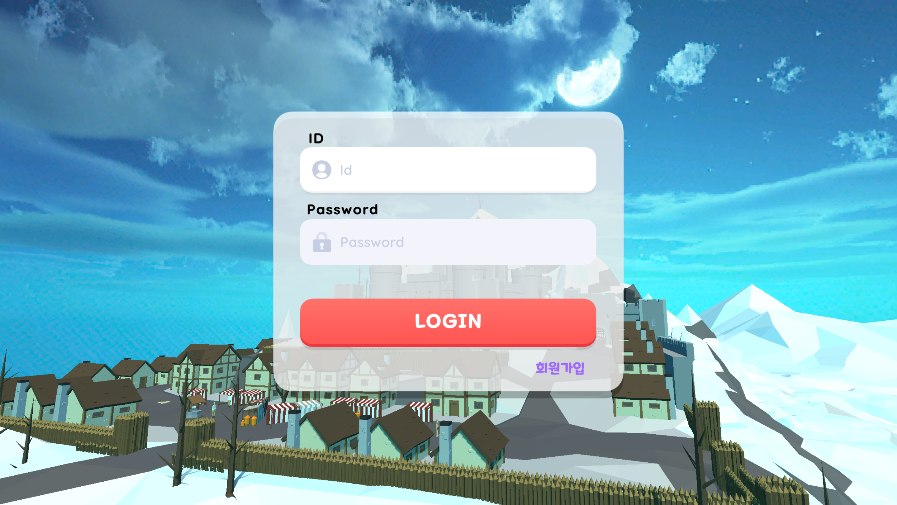
<br/>
- 로그인을 통해 게임 로비로 입장

<br/>

#### 로비 화면

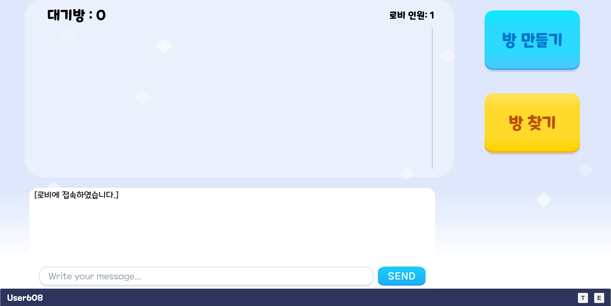
<br/>
- 로비에서 대기방 생성 및 찾기 가능
- 공개방과 비밀방으로 구분되며 비밀방은 비밀번호를 입력해야 입장 가능

<br/>

#### 대기방 화면

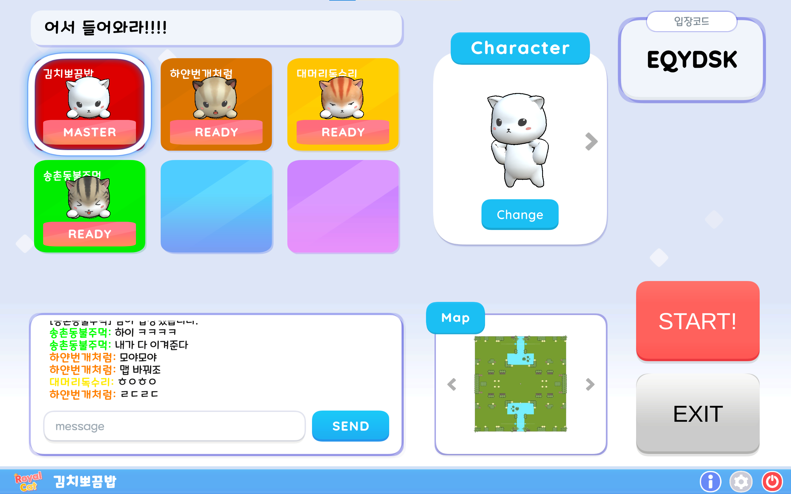
<br/>
- 방 인원들은 Ready 버튼으로 게임 준비
- 방장은 인원들이 모두 Ready 버튼 클릭 시 Start 버튼으로 게임 시작 가능
- 플레이할 맵과 캐릭터 스킨을 고를 수 있음

<br/>

#### 인게임 화면


<br/>
<br/>

### 02. 플레이어 기본 조작 🏃‍♀️

#### 플레이어 이동

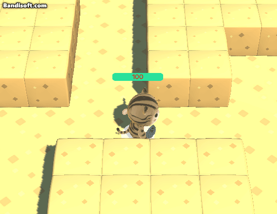
<br/>
 WASD 또는 방향키를 통해 상하좌우로 이동 가능

<br/>

#### 구르기

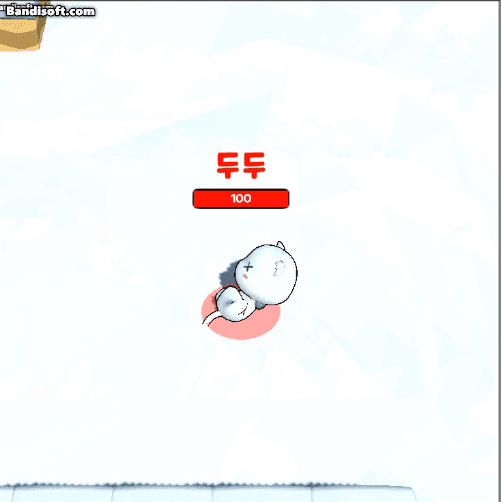
<br/>
 SPACE BAR 키를 통해 빠른 속도로 구르기 가능

<br/>

#### 공격

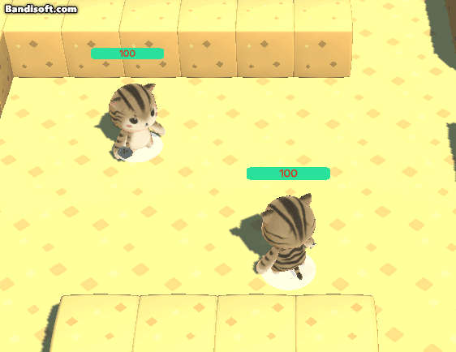
<br/>
 마우스로 투사체를 조준 후 클릭하여 발사 가능, 상대방 피격 시 데미지 부여

<br/>
<br/>

### 03. 인게임 요소

#### 아이템 상자

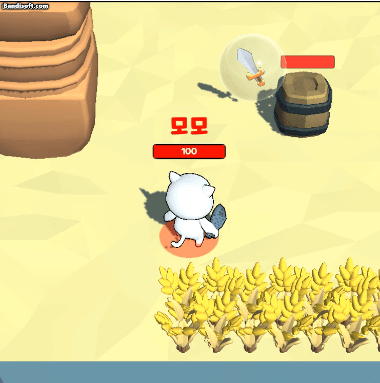
<br/>
아이템 상자를 피격하여 투사체, 버프 아이템 획득

<br/>

#### 부쉬

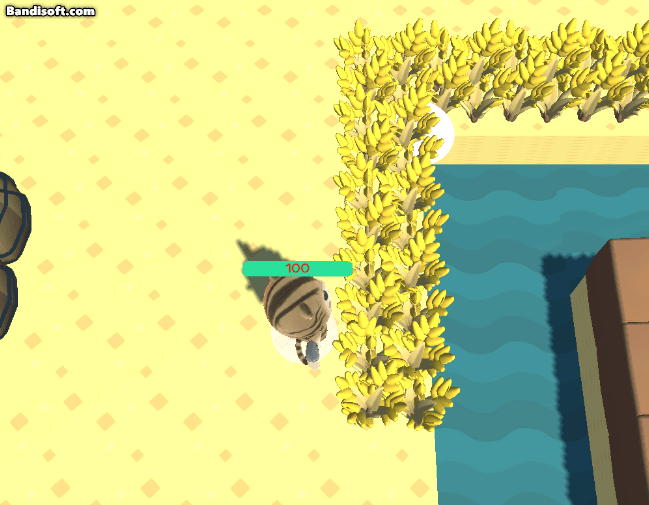
<br/>
부쉬 진입 시 타 플레이어에게 보이지 않는 은신 기능 제공

<br/>

#### 몬스터


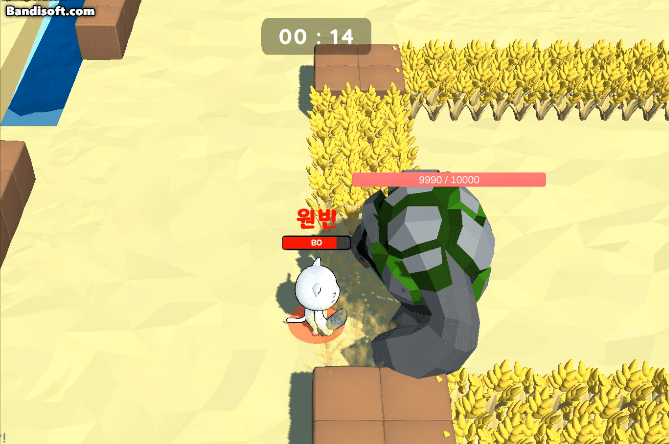
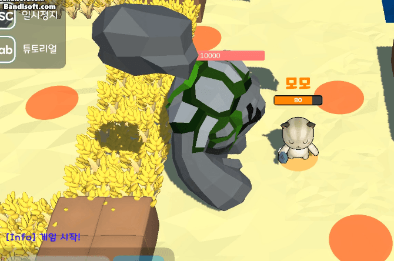
<br/>
사막맵에 존재하며 기본 공격, 범위 공격, 낙석 공격의 패턴을 가짐

<br/>

#### 점프타일


건너편으로 이동 가능

#### 자기장

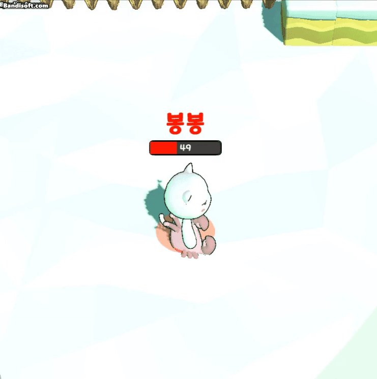
자기장 바깥에 위치할 경우 일정 시간마다 데미지를 입음

<br/>

### 04. 아이템

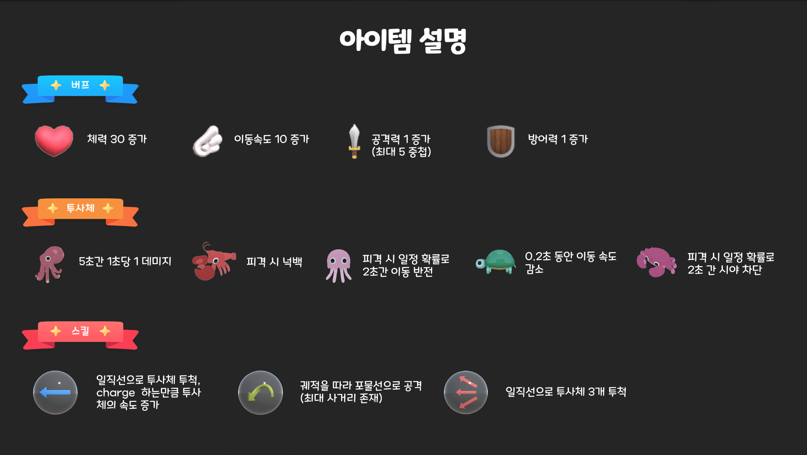

#### 버프

- 플레이어가 획득 시 능력치가 증가하는 아이템
- 체력 회복, 공격력 증가, 방어력 증가, 이동속도 증가

#### 투사체

플레이어를 공격할 때 특수효과가 발동하는 생선 아이템

##### 문어(시야 차단)

  

##### 랍스터(넉백)

  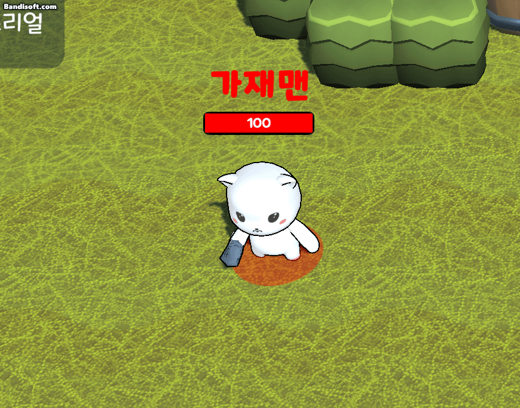

##### 해파리(이동 반전)

  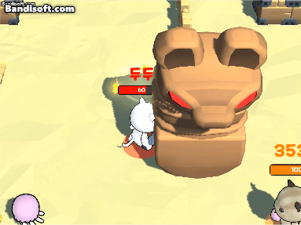

##### 거북이(느려짐)

  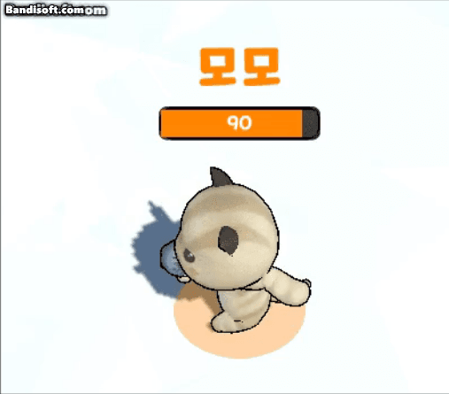
  
##### 꽃게(출혈)

  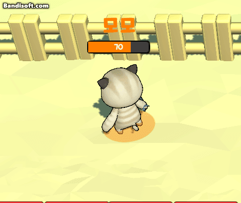

#### 스킬샷

- 플레이어가 획득 시 투사체 발사 방식을 변경하는 아이템
- 멀티샷, 포물선 샷

<br/>

### 05. 맵

사막, 눈, 정글의 3가지 맵으로 구성되며 골렘, 점프 타일 등 특별한 요소를 가짐
<br/>


<br/>

## Ⅲ. 기술 스택

### SERVER

- Photon PUN2
- Photon CHAT
- SpringBoot3
- MySQL

### Front-End

- Unity
- React.js

### Infra

- AWS Redis
- Nginx
- AWS EC2
- Docker

### Tools

- GitLab
- Notion
- Jira
- Figma
- MatterMost

<br>
<br/>

## Ⅳ. 산출물

### 📃 ERD

### ⚙ 아키텍쳐

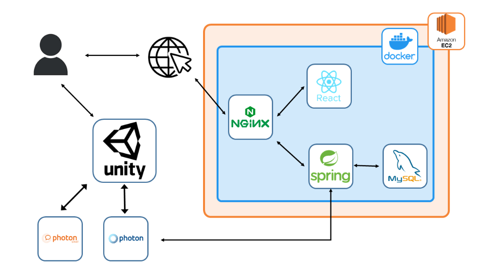

<br/>
<br>

## V. 팀원 소개 및 회고


### 진현지

### 정원빈

### 김성현

### 현준호

### 오성윤

### 오승준
